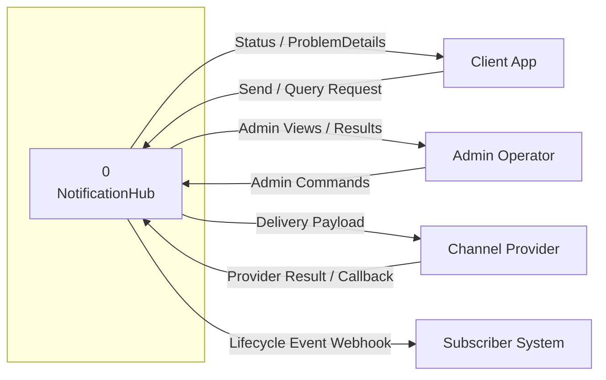
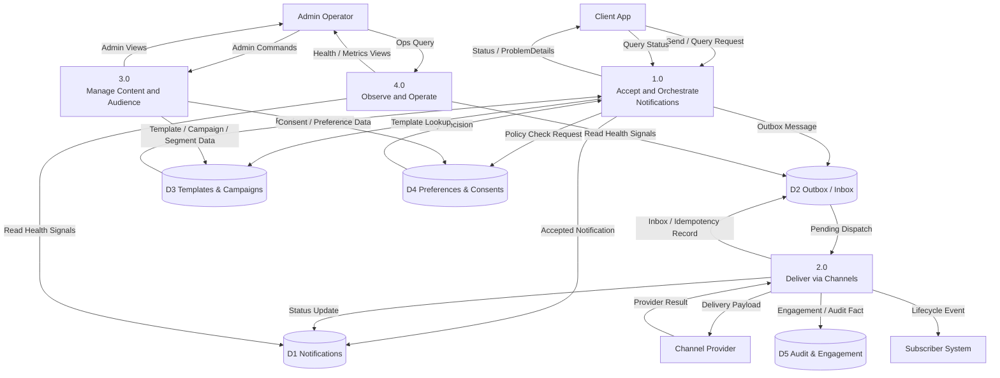
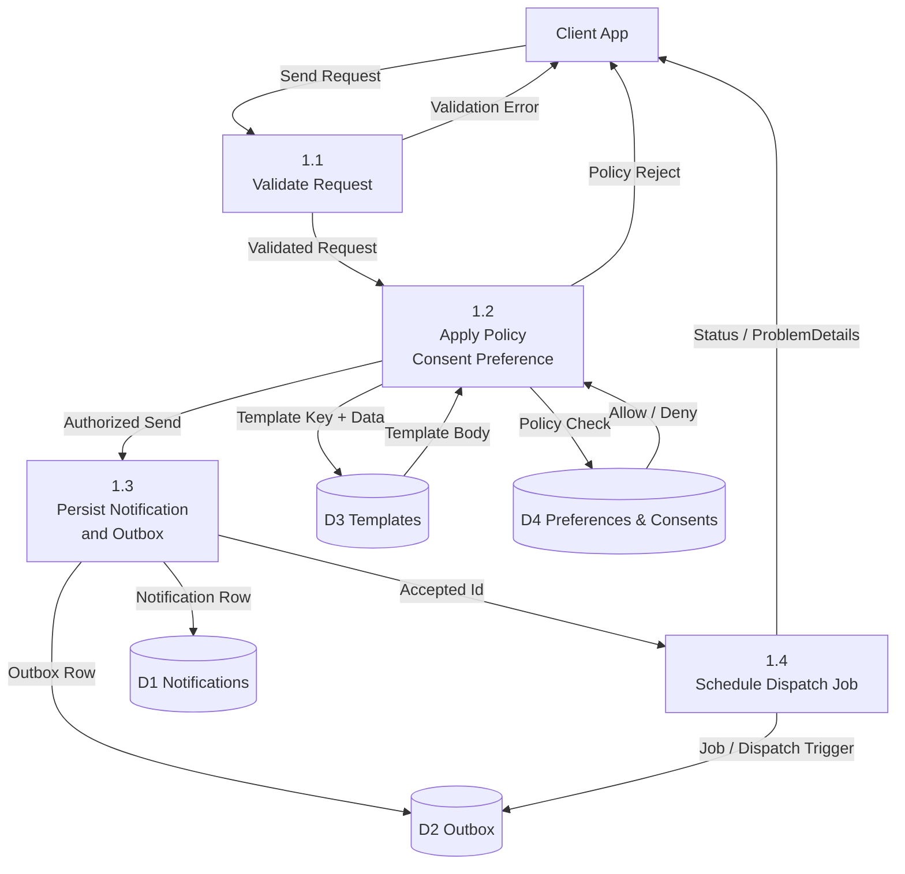
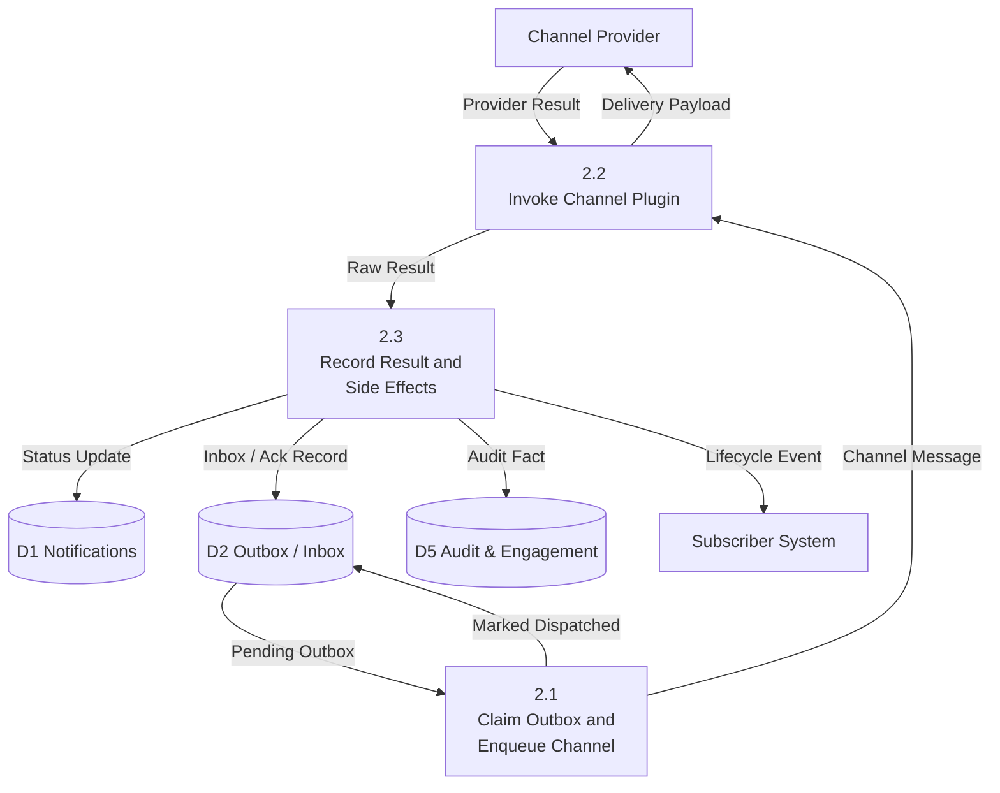
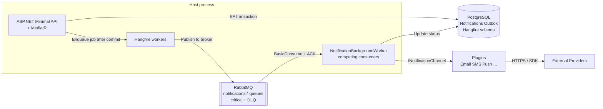
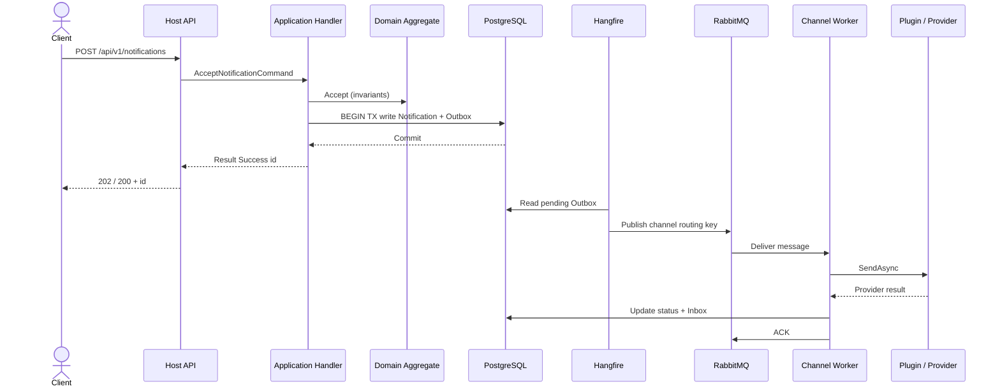
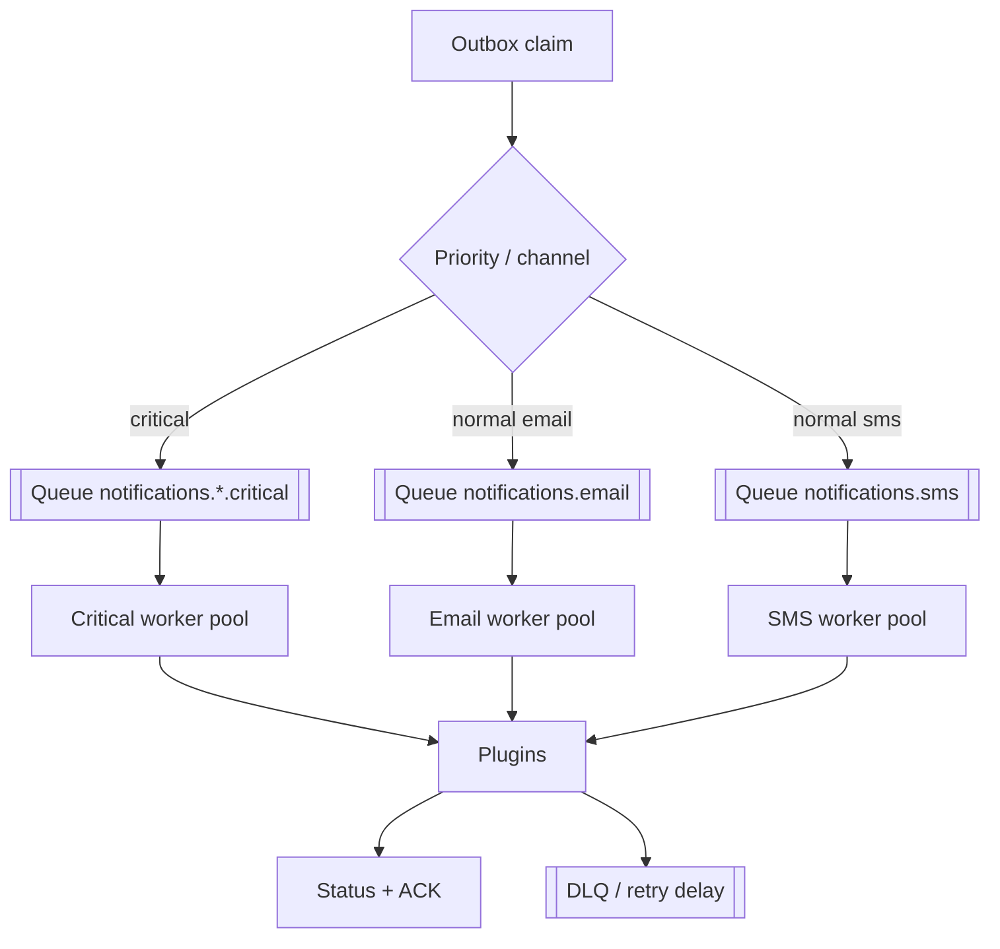

# داستان واقعی NotificationHub  
### از «یه API ساده برای پیامک» تا چیزی که زیر بار هم دوام میاره

> این نوشته اسلاید پرزنتیشن نیست.  
> روایت همون چیزاییه که موقع ساختن این پروژه **گیر کردیم، شکستیم، عوض کردیم** و آخرش فهمیدیم چرا بعضی تصمیم‌ها ارزش داشتن.

اگه فقط یک جمله می‌خوای:

**NotificationHub یه مرکز پسته برای اعلان‌های محصولت** — ایمیل، پیامک، پوش، چت، درون‌برنامه — با صف، تلاش مجدد، رضایت کاربر، کمپین و پلاگین، نه با صد تا `HttpClient` پراکنده توی سرویس‌های مختلف.

---

---

## معماری سیستم — با زبان آدمیزاد و دیاگرام درست

قبل از اینکه بریم سراغ «چی خراب شد و چی درستش کردیم»، باید ببینی **مرز سیستم کجاست** و داده از کجا به کجا می‌رود.  
این بخش را با قواعد کلاسیک **DFD (Gane & Sarson / Whitten)** کشیدیم: موجودیت بیرونی، پردازش، جریان داده، انبار داده — و بین سطح‌ها **balance** رعایت شده.

### موجودیت‌های بیرونی (External Entities)

| نماد | نقش |
|------|-----|
| **Client App** | سرویس محصول تو که API را صدا می‌زند |
| **Admin Operator** | انسان پشت پنل ادمین |
| **Channel Provider** | SendGrid / Twilio / FCM / … |
| **Subscriber System** | سیستم بیرونی که Webhook می‌گیرد |

خودِ NotificationHub = یک سیستم واحد با مرز مشخص؛ provider و کلاینت **داخل** مرز نیستند.

---

### ۱) Context Diagram (نمای ۰ — کل سیستم یک حباب)

کل محصول یک پردازش به شماره **0** است. اینجا **انبار داده نمی‌کشیم**؛ فقط مرز و جریان‌های ورودی/خروجی.



**خواندن دیاگرام:**  
کلاینت درخواست می‌فرستد و وضعیت می‌گیرد؛ ادمین مدیریت می‌کند؛ هاب به provider می‌فرستد و جواب می‌گیرد؛ در صورت نیاز به سیستم مشترک رویداد می‌دهد. هیچ فلشی مستقیم بین Client و Provider نیست — همه از وسط هاب رد می‌شود.

---

### ۲) Hierarchy (Decomposition) — درخت شکستن پردازش‌ها

این DFD نیست؛ **فهرست سطح‌بندی** است تا بدانی Diagram 0 از کجا می‌آید.

```text
                    0  NotificationHub
                    │
     ┌──────────────┼──────────────┬────────────────┐
     │              │              │                │
   1.0            2.0            3.0              4.0
 Accept &        Deliver via     Manage           Observe &
 Orchestrate     Channels        Content &        Operate
 Notifications                   Audience
     │              │              │
  1.1 Validate   2.1 Dispatch   3.1 Templates
  1.2 Apply      2.2 Invoke     3.2 Campaigns
      Policy         Plugin     3.3 Segments /
  1.3 Persist    2.3 Record         Topics /
      + Outbox       Status         Devices
  1.4 Publish                   3.4 Consents /
      Integration                   Preferences
```

---

### ۳) Diagram 0 — سطح بالای منطقی (Logical DFD)

پردازش **0** شکسته می‌شود به چهار پردازش اصلی + انبارهای منطقی.  
هر فلشِ Context اینجا **همان نام** را دارد یا زیر‌بستهٔ معنی‌دارش (balancing).



**نکتهٔ قانونی DFD:** انبار به انبار یا موجودیت به موجودیت مستقیم وصل نیست؛ همه از پردازش رد می‌شود.

---

### ۴) Child DFD برای 1.0 — قبول اعلان (Primitiveتر)

این همان جایی است که Outbox معنی پیدا می‌کند.



**چرا این‌قدر اصرار به 1.3؟**  
چون اگر فقط Notification بنویسی و بعد جداگانه publish کنی، وسط قطعی شبکه می‌گیری «تو DB هست، تو صف نیست». Outbox یعنی **همان تراکنش**.

---

### ۵) Child DFD برای 2.0 — تحویل کانال (منطقی)



---

### ۶) Physical DFD — «واقعاً توی کد چی به چی وصله» (فناوری‌آگاه)

Logical بالا می‌گوید *چه*؛ Physical می‌گوید *با چه ابزار*.



** bridging بین Logical و Physical:**

| Logical | Physical |
|---------|----------|
| 1.0 Accept | API + Application Handlers + Domain + EF |
| Outbox store | جدول Outbox در Postgres |
| 2.1 Claim / Enqueue | Hangfire job → RabbitMQ publish |
| 2.2 Plugin | اسمبلی‌های `Plugins/*` |
| صف کانال | `notifications.email` و … + critical |
| Inbox | رکورد پردازش تکراری در DB |

---

### ۷) Sequence — یک ارسال موفق async (برای حس زمان)



---

### ۸) لایه‌های کد چطور روی این DFD می‌نشینند

```text
  External entities
        │
        ▼
   Host (API)          ← مرز HTTP، API Key، ProblemDetails
        │
   Application         ← 1.1 / 1.2 / use-case orchestration (MediatR)
        │
   Domain              ← قوانین Aggregate (نه I/O)
        │
   Infrastructure      ← D1…D5 فیزیکی، Hangfire، EF
        │
   Plugins             ← 2.2 فقط
        │
   Providers / Webhooks
```

Microkernel یعنی **1.0 و 2.1 و انبارها در هسته می‌مانند**؛ **2.2 قابل تعویض** است بدون دست زدن به دامنه.

---

### ۹) جریان اولویت / لود (مکمل Physical)



این همان دردی بود که گفتیم: بدون این شکستن، OTP می‌رفت ته صف خبرنامه.

---

## اولش مشکل چی بود؟

تقریباً همه‌ی تیم‌ها این مسیر رو می‌رن:

1. اول «بذار مستقیم به Twilio بزنیم»  
2. بعد ایمیل با SendGrid  
3. بعد یهو می‌فهمن اگه سرور ری‌استارت بشه، نصف پیام‌ها دود شدن  
4. بعد OTP زیر خبرنامهٔ میلیونی گیر می‌کنه  
5. بعد حقوقی میگه رضایت بازاریابی کجاست؟  
6. بعد می‌خوان یه کانال جدید اضافه کنن و مجبورن نصف سیستم رو بشکافن  

ما اومدیم بگیم: **هسته ثابت بمونه، کانال‌ها مثل افزونه بیان و برن.**  
اسم قشنگش Microkernel / Plugin است؛ اسم واقعیش اینه که فردا SES جای SendGrid بذاری، نباید کل دامنه و API رو بازنویسی کنی.

---

## فاز اول: ساختار و مرزها (وگرنه شش ماه بعد گم می‌شی)

اول کار پوشه‌ها و solution شلخته بود — همه چی قاطی.  
نشستیم طبق معماری Microkernel لایه‌ها رو جدا کردیم:

| لایه | به زبان آدمیزاد |
|------|------------------|
| **Host** | در ورودی؛ همه‌چی اینجا به هم وصل می‌شه |
| **Domain** | قانون کسب‌وکار؛ «این پیام دیگه قابل ارسال نیست» |
| **Application** | سناریوهای کاربر (فرمان و کوئری) |
| **Infrastructure** | دیتابیس، صف، Hangfire |
| **Plugins** | ایمیل / SMS / پوش / … |

**فایده:** تیم بعدی می‌فهمه کجا دست بزنه.  
**دستمون بسته شد کجا؟** هر فیچر جدید اول باید بپرسه «دامنه است یا زیرساخت؟» — و این عمداً کنده، چون عجله معمولاً مرزها رو خراب می‌کنه.

ADR مرتبط: ساختار solution، Microkernel.

---

## «DDD واقعی» نه فقط اسم روی README

اول مدل‌ها بیشتر شبیه DTO بودن: فیلد زیاد، رفتار کم.  
تست کردیم سناریوهایی مثل «پیام لغو شده دوباره قبول بشه» از چند مسیر مختلف — و دیدیم قانون فقط توی یکی از endpointها نشسته. یعنی از یه در پشتی می‌شد دور زد.

آوردیمش داخل **Aggregate** (Notification، Campaign و …):  
وضعیت‌ها، انتقال مجاز، رویداد دامنه.

**فایده:** قانون یه جا زندگی می‌کنه.  
**محدودیت:** بعضی کارها کندتر جلو می‌ره؛ دیگه نمی‌تونی تو Controller یه `status = Sent` بذاری و رد شی.  
**راه بعدی:** هر اینورینت جدید باید با تست دامنه بیاد، نه با «بعداً درستش می‌کنیم».

---

## Result Pattern — چون Exception برای «پیدا نشد» دروغه

اول هرجا چیزی پیدا نمی‌شد، Exception می‌پروندیم.  
زیر مانیتورینگ انگار سیستم داره می‌ترکه؛ در حالی که «کاربر پیدا نشد» یه شاخهٔ عادی کسب‌وکاره.

اومدیم سراغ **Result / Error** با کد پایدار (`notification.not_found` و …)، و سر مرز HTTP تبدیل به ProblemDetails.

**فایده:** آلارم‌های الکی کمتر؛ API برای کلاینت قابل پیش‌بینیه.  
**دستمون بسته شد:** باید حواست باشه infrastructure failure (دیتابیس قطع) رو با validation قاطی نکنی.  
**بعدی:** همه‌ی Handlerها یکدست با Map/Bind جلو برن، نه نصف‌نصف.

---

## CQRS سبک + MediatR

هر عمل مهم شد Command یا Query.  
Validation و رفتارهای مشترک افتاد تو Pipeline.

**فایده:** Controller لاغر؛ تست سناریو ساده‌تر.  
**محدودیت:** برای CRUD خیلی ساده ممکنه زیاده‌روی به نظر برسه — برای هاب اعلان ارزشش رو داشت.

---

## صف و لود بالا: این‌جا داستان جدی شد

### مشکل واقعی که دیدیم

زیر ترافیک، چند تا درد با هم اومدن:

- یه صف برای همه‌چی → **OTP پشت کمپین** می‌موند  
- Prefetch زیاد بدون محدودیت داخل اپ → workerها خفه می‌شدن  
- صف critical تعریف نشده بود → consumer می‌اومد `NOT_FOUND` می‌گرفت و **کل Host می‌خوابید** (BackgroundService exception → StopHost)  
- ACK زودتر از پردازش = خطر از دست رفتن یا برعکس، پیام تکراری بدون Inbox

### چی کار کردیم؟

1. **صف جدا per-channel** (`notifications.email` و …)  
2. مسیر **critical** برای اولویت بالا  
3. Prefetch از سمت broker + **Semaphore** داخل اپ (دو تا اهرم جدا)  
4. قبل از consume، **اعلام topology** تا 404 نخوریم  
5. worker با **retry**؛ دیگه یه خطای صف کل پروسس رو نکشه  
6. DLQ و تأخیر برای retry  
7. Channel داخلی **bounded** تا حافظه زیر اسپایک منفجر نشه

**فایده:** زیر فشار، مسیر مهم‌تر زنده می‌مونه؛ سیستم «گرسنه» یا «منفجر» نمی‌شه یک‌شبه.  
**دستمون بسته شد:** پیچیدگی عملیات بیشتر شد (چند صف، مانیتورینگ جدا).  
**راه بعدی:** تنظیم دقیق prefetch/concurrency با متریک واقعی، نه حدس.

ADR: Worker management، latency/concurrency، critical workers، queue isolation.

---

## «پیام ذخیره شد ولی به صف نرسید» — کلاسیک توزیع‌شده

اگه تو یه تراکنش فقط DB رو بنویسی و بعد `BasicPublish` کنی، یه لحظه قطعی شبکه یعنی **ناسازگاری**.

آوردیم **Transactional Outbox**:  
همان Commit، هم وضعیت اعلان هم ردیف Outbox.  
بعد **Hangfire** (نه به‌عنوان message broker، به‌عنوان اجرای مطمئن کار) اون ردیف‌ها رو می‌فرسته سمت RabbitMQ.  
**Inbox** جلوی پردازش تکراری رو می‌گیره.

**فایده:** «حداقل یک‌بار» با پردازش امن.  
**محدودیت:** تأخیر کوچیک اضافه می‌شه؛ باید reconciliation و schema (migration Hangfire) درست باشه — یه‌بار جدول‌ها دیده نمی‌شدن تا migration + installer رو سفت کردیم.  
**بعدی:** مانیتور backlog Outbox و آلارم وقتی از آستانه رد شد.

---

## امنیت؛ نه شعار آخر پروژه

سخت‌سازی مرحله‌ای:

- API Key و نقش  
- Rate limit  
- CORS آگاهانه (از جمله برای پنل ادمین)  
- داشبورد Hangfire پشت کلید  
- جلوگیری از webhook به آدرس‌های خطرناک داخلی  
- اسکن آسیب‌پذیری NuGet / بعداً Trivy و CodeQL تو CI  

**فایده:** هاب اعلان تبدیل به رله اسپم نمی‌شه.  
**محدودیت:** هر endpoint جدید باید از همون دروازه رد بشه؛ «بعداً auth می‌ذاریم» ممنوع.

---

## DI با Scrutor — از صد خط ثبت خسته شده بودیم

ثبت دستی سرویس‌ها هم خطا می‌زاید هم merge conflict.  
Convention با Scrutor برای بخش عمده؛ موارد خاص (دکوراتور، چند پیاده‌سازی پلاگین) صریح موند.

**فایده:** Host خلوت‌تر.  
**ریسک:** convention اشتباه = سرویس غلط ثبت می‌شه → با تست Architecture و smoke باید مهار بشه.

---

## پرفورمنس و cold-start: بدون قمار روی AOT

اندازه‌گیری و تجربه‌ی عملی گفت:

- **Native AOT** الان با پلاگین + EF + Hangfire بیشتر دردسره تا سود  
- **ReadyToRun + Tiered PGO + Server GC** ترکیب منطقی‌تره  
- روی hot path صف: deserialize از **UTF-8 span** (بدون `GetString` الکی)، serialize بدون JSON میانی UTF-16  
- سقف body و تنظیمات Kestrel زیر عنوان HighLoad  
- DATAS روی .NET 9 پیش‌فرضه؛ الکی خاموشش نکردیم  

**فایده:** استارتاپ و مسیر داغ بهتر، بدون شکستن اکوسیستم پلاگین.  
**دستمون بسته شد:** تا قرارداد پلاگین trim-safe نشه، AOT نمی‌آد.  
**بعدی:** عدد allocation-rate و time-in-gc زیر بار واقعی، بعد هر دستکاری GC.

---

## مشاهده‌پذیری و Aspire

لاگ ساخت‌یافته (Serilog)، Health برای وابستگی‌ها، آمادگی OTEL/Jaeger، و Aspire برای ترکیب محیط dev.

**نکته‌ای که جدا کردیم:** Aspire برای **ترکیب زیرساخت dev** است، نه جای orchestration کسب‌وکار (workflow اعلان). این دو تا رو قاطی نکردیم.

---

## پنل ادمین Next.js — دموی محصول، نه فقط Swagger

ساختیم `apps/admin` با Tailwind و shadcn/ui و DataTable:

- ارسال و پیگیری اعلان  
- قالب، کمپین ویزاردی، workflow  
- سگمنت، تاپیک، دستگاه  
- رضایت و preference  
- وب‌هوک و engagement  
- تنظیم API key و تست اتصال  

**فایده:** ذی‌نفع غیرتوسعه‌دهنده می‌فهمه محصول چیه.  
**محدودیت:** هنوز دموست؛ auth پنل و چندتنانسی UI داستان جداست.

---

## CI/CD که فقط «سبز بودن build» نیست

اول pipelineها می‌ترکید (نسخه OpenApi، تست‌های Result، Dockerfile ناقص، …).  
درستشون کردیم و بعد مجموعه کامل workflow:

- بیلد و تست دات‌نت + معماری  
- اسکن امنیت (NuGet، CodeQL، Trivy)  
- CI پنل ادمین  
- Integration با Postgres و RabbitMQ و smoke روی `/health`  
- Nightly، Release روی tag، SBOM/Cosign  
- Dependabot برای NuGet و npm  

**فایده:** رگرسیون زودتر دیده می‌شه.  
**هزینه:** دقیقه Actions و گاهی flaky بودن integration اگر env ناقص باشه — لاگ Host رو artifact کردیم که دیباگ سخت نباشه.

---

## چیزای دیگه‌ای که توی نسخهٔ قبلی بلاگ جا مونده بود

- **Integration events** جدا از domain events (قرارداد بیرونی پایدار)  
- **کمپین و broadcast** با چرخه حیات  
- **Consent / preference** قبل از ارسال بازاریابی  
- **سگمنت و topic و device** برای مخاطب  
- **Connection string و Aspire** که یه‌بار با config اشتباه کل استارتاپ می‌ترکید — resolver چندکلیدی  
- **Migration** برای schemaهایی که «فقط runtime» ساخته می‌شدن و تو محیط تمیز دیده نمی‌شدن  
- **`.editorconfig`** برای یکدست‌کردن تیم و CI format  
- **ADRها** (بیش از پانزده تا) که حافظهٔ تصمیم‌ان؛ شش ماه بعد خودت هم فراموش می‌کنی چرا Hangfire اومد وسط  

---

## مسیر یه پیام (جمع‌بندی خودمونی)

```text
کلاینت / پنل ادمین
    → API + API Key + اعتبارسنجی + Result
    → Handler (MediatR)
    → دامنه (قانون)
    → DB + Outbox (یه تراکنش)
    → Hangfire / worker
    → RabbitMQ (صف کانال یا critical)
    → Plugin (SendGrid / Twilio / …)
    → وضعیت + اختیاری Webhook / رویداد بیرونی
```

اگه هر کدوم از این حلقه‌ها نباشه، یه جایی تو پروداکشن «گاهی کار می‌کنه» می‌شنوی — بدترین جمله برای سیستم پیام‌رسانی.

---

## چی عمداً نکردیم (و پشیمون هم نیستیم)

- میکروسرویس از روز اول  
- AOT قبل از آماده‌شدن مرز پلاگین  
- یه صف واحد برای همه‌ی ترافیک  
- Exception به‌جای خطای کسب‌وکار  
- امنیت «آخر اسپرینت»  
- بهینه‌سازی GC بدون عدد  

مهندسی گاهی یعنی **نه** بگی به پیچیدگی زودرس.

---

## برای کسی که فنی نیست

فرض کن یه اداره پست هوشمند داری:

- نامه رو ثبت می‌کنه  
- می‌دونه کدوم کیسه برای OTPه، کدوم برای خبرنامه  
- اگه پستچی زمین خورد، نامه گم نمی‌شه؛ دوباره می‌فرسته  
- اگه فرستنده اجازه بازاریابی نداشته باشه، نامه نمی‌ره  
- و همیشه می‌تونی بپرسی نامه الان کجاست  

NotificationHub همون اداره‌ست برای پیام‌های محصولت.

---

## برای کسی که می‌خواد بره تو کد

ترتیب پیشنهادی:

1. `docs/ADR-012-Solution-Structure-Microkernel.md`  
2. `docs/ADR-005-Domain-Driven-Design.md`  
3. `docs/ADR-009-Hangfire-Messaging-Reliability.md`  
4. `docs/ADR-006-RabbitMQ-Worker-Management.md`  
5. `docs/ADR-016-Result-Pattern.md`  
6. `docs/ADR-018-High-Load-Optimization.md`  
7. `apps/admin` — دست بزن، حس محصول رو ببین  
8. `.github/workflows/README.md` — ببین CI از چی مواظبت می‌کنه  

---

## حرف آخر

این پروژه یه CRUD تولیدشده با داربست نیست.  

یه سری تصمیم سخت گرفته شد چون **زیر بار و تو شکست واقعی** مجبور شدیم، نه چون توئیتر گفته بود «باید Outbox داشته باشی».  

اگه یه چیز از این قصه بمونه:

**اول قابلیت اطمینان و مرز تمیز؛ بعد داشبورد خوشگل.**  
داشبورد رو هم ساختیم — ولی بعد از اینکه پیام گم نشه.

---

*نسخهٔ روایی هم‌راستا با شاخه `dev` — به‌روز شده با صف، Hangfire، DDD، Result، امنیت، پرفورمنس، پنل ادمین و CI کامل.*
